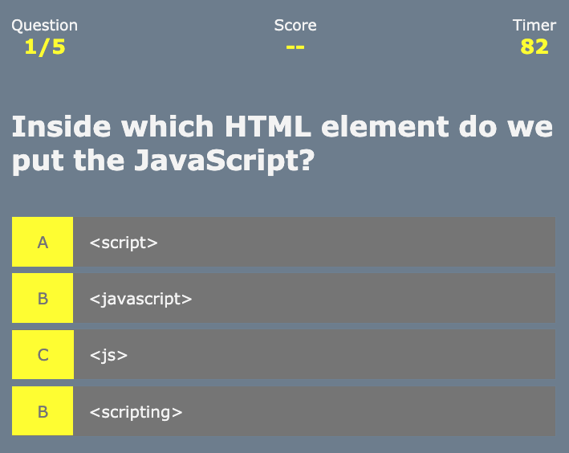

# 04 Web APIs: Code Quiz Homework

For this assigment I built a timed code quiz with multiple-choice questions. This app runs in the browser and features dynamically updated HTML and CSS powered by JavaScript code.
It will also feature a clean and polished user interface and be responsive, ensuring that it adapts to multiple screen sizes.

## Screenshots of Project

